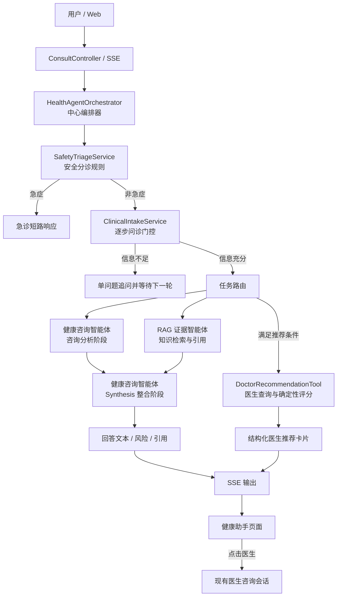

# 健康助手多智能体架构设计

版本：V1.0  
日期：2026-07-14  
适用模块：健康助手、健康知识库、医生专家推荐、医生在线咨询

## 1. 设计结论

健康助手采用**中心化编排的多智能体工作流（Orchestrated Multi-Agent Workflow）**。系统不是多个智能体自由协商的群体架构，也不是传统的数据复制型主从架构，而是由 `HealthAgentOrchestrator` 按固定医疗安全流程控制两个核心智能体以及若干业务服务和 Tool。

核心智能体数量保持为 **2 个**：

1. **健康咨询智能体（Health Consultation Agent）**
2. **RAG 证据智能体（RAG Evidence Agent）**

以下组件不计入智能体数量：

- `HealthAgentOrchestrator`：中心编排器和工作流控制器，不负责医学内容生成。
- `SafetyTriageService`：确定性安全分诊规则节点。
- `ClinicalIntakeService`：逐步问诊门控；即使内部使用模型判断信息完整度，也属于健康咨询智能体的前置能力，不独立计为新智能体。
- Synthesis 阶段：健康咨询智能体的最终整合阶段，不是独立智能体。
- `DoctorRecommendationTool`：受控业务 Tool，不具备自主决策能力。
- 健康档案、长期记忆、审计、医生库和咨询会话服务：业务基础设施。

## 2. 总体架构与关系



关系说明：

- 编排器对两个智能体是 **Supervisor–Worker** 关系。
- 两个智能体之间不直接交换消息，均通过编排器接收输入和返回结果。
- 医生推荐 Tool 由编排器按规则调用，不属于第三个智能体。
- 健康咨询智能体负责用户可读回答；RAG 证据智能体只提供可信资料，不直接面向用户生成最终结论。
- Tool 返回的医生信息和分数保持结构化，不交给模型重新编造。

## 3. 智能体定义

### 3.1 健康咨询智能体

职责：

- 理解健康诉求和已经完成的问诊摘要。
- 生成保守的护理建议、观察重点和就医时机。
- 结合风险等级、授权健康上下文和 RAG 证据生成最终回答。
- 遵守不确诊、不开处方、不调整药量等医疗安全要求。

输入：用户问题、问诊摘要、风险评估、授权健康档案、RAG 命中资料。  
输出：回答文本、风险说明、使用的档案类别和引用信息。

代码映射：`HealthAgentOrchestrator.consultationWorker` 和最终 Synthesis 模型调用。二者是同一个逻辑智能体的分析、整合两个阶段。

### 3.2 RAG 证据智能体

职责：

- 根据问诊摘要检索已发布的健康知识。
- 完成查询改写、召回、重排和可信度过滤。
- 返回知识片段及可展示引用。
- 检索失败时返回空结果，由主流程降级为保守通用回答。

输入：用户问题或临床摘要。  
输出：`KnowledgeHit` 列表和 `AgentCitation` 引用。

代码映射：`HealthAgentOrchestrator.evidenceWorker`、`KnowledgeRetrievalService` 及其检索组件。

## 4. 完整工作流程

### 4.1 正常健康咨询

1. Web 调用 `/api/consult/chat/stream`，后端建立或恢复会话。
2. 编排器加载用户明确授权的健康上下文。
3. 安全分诊规则检查急症危险信号。
4. 逐步问诊门控判断信息是否足够；不足时每轮只追问一个关键问题。
5. 信息充分后，编排器生成统一 `clinicalQuery`。
6. 健康咨询智能体与 RAG 证据智能体并行执行。
7. 满足医生推荐条件时，编排器同时调用 `DoctorRecommendationTool`。
8. 健康咨询智能体在 Synthesis 阶段整合风险、咨询分析和 RAG 证据。
9. SSE 依次返回阶段状态、风险、回答文本、医生推荐卡片和 `done`。
10. 回答、引用、医生推荐和审计追踪 ID 持久化到当前会话。

### 4.2 急症短路

当风险被判定为 `EMERGENCY` 时：

- 不进入逐步问诊。
- 不调用健康咨询智能体、RAG 证据智能体和医生推荐 Tool。
- 直接提示立即呼叫急救或前往急诊，避免线上流程延误处置。

### 4.3 信息不足

当问诊门控返回 `ASK` 时：

- 保存问诊状态并返回一个快捷选项问题。
- 本轮不进行病因分析、RAG 检索和医生推荐。
- 用户回答后恢复同一问诊状态并重新执行安全分诊。

### 4.4 医生推荐 Tool 触发规则

满足以下任意条件时调用：

- 用户明确表达“推荐医生、找专家、挂什么科、向医生咨询”等意图。
- 风险等级为 `MEDIUM` 或 `HIGH`，分诊结果已建议及时或尽快就医。

以下情况不调用：

- `EMERGENCY` 急症。
- 仍处于问诊追问阶段。
- 普通低风险知识问答且用户没有找医生意图。
- 配置 `DOCTOR_RECOMMENDATION_ENABLED=false`。

## 5. DoctorRecommendationTool 设计

Tool 接收用户本轮消息和已完成的问诊摘要，只访问后端允许的医生查询服务。候选医生必须满足：

- `status = 1`
- `audit_status = APPROVED`
- 已绑定医生登录用户，能够进入真实咨询会话
- 科室或擅长领域至少有一项命中当前诉求

匹配度为 0–100，表示医生资料与当前诉求的相关程度，不代表诊疗质量：

| 维度 | 权重 | 说明 |
|---|---:|---|
| 科室匹配 | 45% | 首选科室完全或近似匹配得分最高 |
| 擅长匹配 | 40% | 最多按三个健康关键词计算命中比例 |
| 职称 | 10% | 主任、副主任、主治及其他按固定档位计分 |
| 指定医院 | 5% | 仅用户明确指定医院时参与计算 |

未指定医院时按其余 95 分归一化为百分制。同分依次按科室匹配、擅长命中数和医生 ID 排序。最多返回 3 位；不足 3 位按实际数量返回，不放宽条件凑数。

推荐原因由得分项确定性生成，例如“科室与当前健康诉求匹配”“擅长领域命中：高血压”“职称：主任医师”。Tool 不调用模型，不生成诊断，不虚构医生经验或疗效。

## 6. 接口、事件与页面闭环

同步响应和历史消息增加 `recommendedDoctors`；SSE 增加事件：

```json
{
  "type": "doctor_recommendations",
  "recommendedDoctors": [
    {
      "doctorId": 1,
      "name": "李明华",
      "hospital": "市第一人民医院",
      "department": "心血管内科",
      "title": "主任医师",
      "speciality": "高血压、冠心病、心力衰竭",
      "matchScore": 100,
      "reasons": ["科室与当前健康诉求匹配", "擅长领域命中：高血压"],
      "action": {
        "type": "START_DOCTOR_CONSULT",
        "route": "/doctor-consult",
        "doctorId": 1
      }
    }
  ]
}
```

Web 展示医生头像、姓名、医院、科室、职称、擅长、匹配度和推荐原因。用户点击“向 TA 咨询”后进入：

```text
/doctor-consult?doctorId={doctorId}
```

目标页面复用现有 `POST /api/doctor-consult/session/{doctorId}` 创建或恢复会话。系统不会自动把健康档案或 AI 问诊摘要发送给医生；如后续需要带入，必须增加用户确认和资料授权。

## 7. 状态、审计与失败降级

- `agent_run` 保存整轮路由、风险、耗时和状态。
- `agent_run_step` 以 `doctor_recommendation_tool` 记录 Tool 状态、耗时和返回医生 ID。
- `agent_chat_turn.doctor_recommendations_json` 保存推荐快照，保证历史会话能够恢复原卡片。
- Tool 超时、数据库异常或无匹配医生时，主健康回答继续完成；前端不展示空卡片。
- RAG 失败不会阻断咨询；回答必须说明证据局限。
- 所有急症规则优先于模型、RAG 和 Tool Calling。

## 8. 架构边界

- 模型不拥有 SQL 或任意数据库访问权限。
- 医生推荐分数只能由后端确定性规则计算。
- Tool 不能自行触发，由中心编排器基于风险和用户意图调用。
- 新增一个 Tool 不等于新增一个 Agent；只有形成独立目标、上下文、决策与输出职责的推理单元才计为智能体。
- 多次模型调用也不必然代表多个智能体。本系统的咨询分析与 Synthesis 是健康咨询智能体的两个工作阶段。
